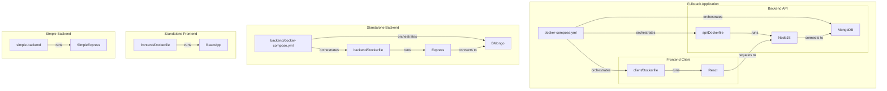

<div align="center">

# 🐳 Docker for Developers

A comprehensive guide to Docker commands and configurations for various application components

</div>

## 📋 Table of Contents

- [Summary](#-summary)
- [Introduction](#-introduction)
- [Backend Commands](#-backend-commands)
- [Frontend Commands](#-frontend-commands)
- [Fullstack with Docker Compose](#-fullstack-with-docker-compose)
- [Simple Projects](#-simple-projects)
- [Project Architecture](#-project-architecture)
- [Resources](#-resources)

<div align="center">

## 🔍 Summary

</div>

This repository contains Docker configurations and commands for various application components including backend services, frontend applications, and fullstack setups. It provides a practical guide for containerizing different parts of a web application using Docker and Docker Compose.

The project includes:
- Backend service with Node.js and MongoDB
- Frontend application with React
- Fullstack setup with Docker Compose
- Simple backend implementation examples

Each component has its own Dockerfile and configuration, demonstrating best practices for containerizing web applications.

<div align="center">

## 🚀 Introduction

</div>

Docker is a platform for developing, shipping, and running applications in containers. Containers allow developers to package an application with all its dependencies and ship it as a single unit.

> **Note:** When working with Docker, always start by finding an appropriate base image on Docker Hub that matches your application's requirements.

The first step in creating a Dockerfile is to look for a base image on Docker Hub and copy the specific name. This allows you to start from an image tailored to your framework (like Spring), simplifying the setup process.

Docker Hub website for searching images: [https://hub.docker.com/](https://hub.docker.com/)

<div align="center">

## 🔙 Backend Commands

</div>

### Build an Image

```bash
docker build -t jonathasrochadesouza/backend .
```

### List Images

```bash
docker images
```

### Run a Container

```bash
docker run -p 4000:4000 jonathasrochadesouza/backend
```

To free console CLI, add flag '-d'
```bash
docker run -d -p 4000:4000 jonathasrochadesouza/backend
```

If error because version
```bash
docker run -e "NODE_OPTIONS=--openssl-legacy-provider" -p 4000:4000 jonathasrochadesouza/backend
```

### Check Running Containers

```bash
docker ps
```

### Stop a Container

```bash
docker stop <container_id>
```

### Remove an Image

```bash
docker rmi <image_id>
```

### Force Stop a Container and kill image

```bash
docker kill <container_id>
```

<div align="center">

## 🖥️ Frontend Commands

</div>

### Build an Image

```bash
docker build -t jonathasrochadesouza/frontend .
```

### List Images

```bash
docker images
```

### Run a Container

```bash
docker run -p 3000:3000 jonathasrochadesouza/frontend
```

To free console CLI, add flag '-d'
```bash
docker run -d -p 3000:3000 jonathasrochadesouza/frontend
```

If error because version
```bash
docker run -e "NODE_OPTIONS=--openssl-legacy-provider" -p 3000:3000 jonathasrochadesouza/frontend
```

### Check Running Containers

```bash
docker ps
```

### Stop a Container

```bash
docker stop <container_id>
```

### Remove an Image

```bash
docker rmi <image_id>
```

### Force Stop a Container and Kill Image

```bash
docker kill <container_id>
```

<div align="center">

## 🔄 Fullstack with Docker Compose

</div>

### Build an Image (compose)

For all services:
```bash
docker-compose build
```

For individual services:
```bash
docker-compose build -d mongo
```

```bash
docker-compose build -d app
```

```bash
docker-compose build -d client
```

### List Images

```bash
docker images
```

### Run a Container

For all services:
```bash
docker-compose up -d
```

For individual services:
```bash
docker-compose up -d mongo
```

```bash
docker-compose up -d app
```

```bash
docker-compose up -d client
```

### Check Running Containers

```bash
docker ps
```

### Stop a Container

```bash
docker stop <container_id>
```

### Remove an Image

```bash
docker rmi <image_id>
```

### Force Stop a Container and Kill Image

```bash
docker kill <container_id>
```

<div align="center">

## 🏗️ Project Architecture

</div>

The project is organized into several components, each with its own Docker configuration:

```
docker_for_developers_linkedIn/
|
|-- README.md                 # Main documentation
|
|-- backend/                  # Backend service
|   |-- Dockerfile            # Backend container configuration
|   |-- docker-compose.yml    # Compose for backend with MongoDB
|   |-- index.js              # Main backend application file
|   |-- package.json          # Node.js dependencies
|   |-- README.md             # Backend documentation
|   |-- src/                  # Source code
|   |   |-- controllers/      # API controllers
|   |   |-- models/           # Data models
|   |   |-- routes/           # API routes
|   |-- public/               # Static files
|   |-- data/                 # MongoDB data
|
|-- frontend/                 # Frontend application
|   |-- Dockerfile            # Frontend container configuration
|   |-- package.json          # Node.js dependencies
|   |-- README.md             # Frontend documentation
|   |-- public/               # Static files
|   |-- src/                  # Source code
|
|-- fullstack/                # Fullstack application
|   |-- docker-compose.yml    # Compose for all services
|   |-- README.md             # Fullstack documentation
|   |-- api/                  # Backend API
|   |   |-- Dockerfile        # API container configuration
|   |   |-- index.js          # Main API file
|   |   |-- package.json      # Node.js dependencies
|   |-- client/               # Frontend client
|   |   |-- Dockerfile        # Client container configuration
|   |   |-- package.json      # Node.js dependencies
|   |-- data/                 # MongoDB data
|
|-- simple-backend/           # Simple backend example
    |-- README.md             # Simple backend documentation
```

### Docker Architecture Diagram



<div align="center">

## 📚 Resources

</div>

#### Docker CLI References

For more detailed information about Docker commands, visit the official Docker CLI documentation:
[https://docs.docker.com/reference/cli/docker/](https://docs.docker.com/reference/cli/docker/)

#### Docker searching images

Docker Hub website for searching images: [https://hub.docker.com/](https://hub.docker.com/)

---

<div align="center">

*Study with love from Jonathas* ❤️

</div>